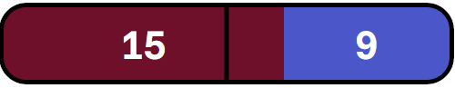
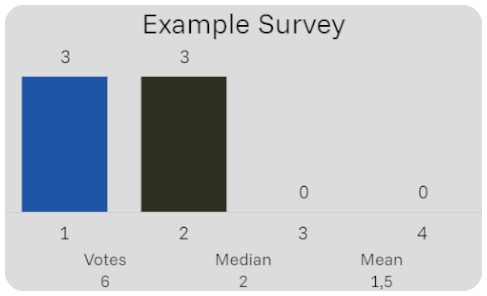

# Stream Widgets

A collection of small widgets to be used as Browser Sources in OBS to increase Twitch Chat interaction.

## Quick Survey

Displays a stacked horizontal bar when users enter numbers in chat to vote.
Automatically detects when users in chat start voting after some votes have been cast.
The default vote options are `1` and `2`, which can optionally be extended up to `4`.

### Integration

URL using default options: `https://dascleverle.github.io/stream-widgets/quick-survey.html?channel={channelName}`
Replace `{channelName}` with your Twitch Channel name.

The dimensions of the vote bar are determined by the size of the browser source in OBS (Recommended size for 1920x1080 is **500x90**);

#### Options

Add options by appending URL query paramters to the above link.

* `channel`: Your Twitch Channel name to listen for chat messages (required).
* `timeout`: The time in seconds to keep the vote bar displayed after the last vote was cast (default: 30).
* `minVotes`: The amount of votes that need to be cast, before the vote bar is displayed (default: 3).
* `voteOptions`: The available vote options. A number between 2 and 4. (default: 2).
* `debug`: Enable debug mode where the same user can cast multiple votes (default: false).

### Chat Commands

Commands are available for the broadcaster and all mods of the channel.

* `!qsenable`: Enables the vote bar if it was disabled previously.
* `!qsdisable`: Hides the vote bar and disables automatic vote detection.
* `!qsreset`: Resets all votes, so that a new survey can be started before the timeout has been reached.

## Survey

Displays a configurable survey chart with an unlimited number of options.

### Integration

URL using default options: `https://dascleverle.github.io/stream-widgets/survey.html?channel={channelName}`
Replace `{channelName}` with your Twitch Channel name.

The dimensions of the widget are determined by the size of the browser source in OBS (Recommended size for 1920x1080 is **500x300**);

#### Options

* `channel`: Your Twitch Channel name to listen for chat messages (required).
* `debug`: Enable debug mode where the same user can cast multiple votes (default: false).

### Chat Commands

* `!newvote {options} {title}`: Creates a new survey; options can be in the format `{character}-{character}`, e.g. `A-F`, or `{number}-{number}`, e.g `1-3`
  to create options ranging from and including the first character/number to including the second character/number.
  Optionally after the vote options a title can be entered for the survey.
  Automatically shows the chart if it was hidden previously.
  Viewers can then enter a message containing only the option to cast a vote.
* `!showvote`: Displays the chart again after it was hidden.
* `!hidevote`: Hides the chart, votes are be retained, but no new votes will be collected.
* `!resetvote`: Resets all votes, effectively restarting the voting.
* `!votetitle {title}`: Sets a new survey title.
